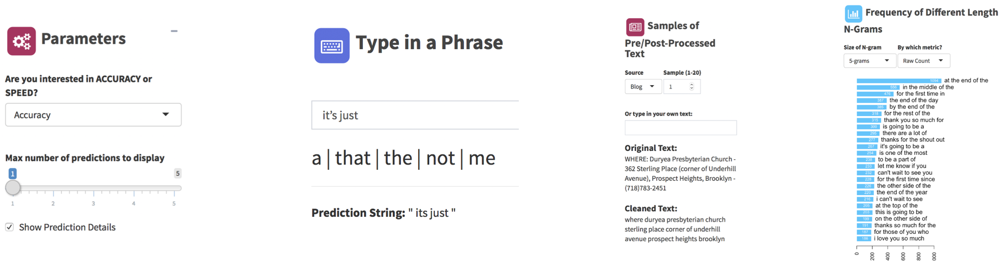

Capstone Project: Text Prediction Application
========================================================
author: Erich F Gruhn
date: September 01, 2018
autosize: true


.

The Task
========================================================

This Shiny application has created for the Capstone assignment of the Johns Hopkins University Data Science Specialization.  The project was co-sponsored by SwiftKey. 

The assignment was to create a model from texts taken from online blogs, news articles, and Twitter posts using the following dataset: ([Coursera-SwiftKey-Datasets](https://d396qusza40orc.cloudfront.net/dsscapstone/dataset/Coursera-SwiftKey.zip))

The model was to be used to build an algorithm that may best predict the next word in a phrase based on the many phrases collected in the original data.

The requirement for this project was to create a Shiny application that responds to user input, takes the word(s) entered and predicts the next word.

The Model
========================================================
<p style="font-size:24px">
The model uses a contiguous set of "n" items from a given sequence of text (an N-gram) created from various text sources. 

The <span style="font-weight:bold;color:red">tm</span> package was primarily used to create a corpus of the texts in order to complete pre-processing. This pre-processing used various methods of cleaning and preparing the text, some of this cleaning included removal of profanity, web-text filtering, conversion of lower case to ASCII, elimination of numbers, and end of sentence tagging. For example:</p>


```
[1] Raw Text: These guys are playing WAY BEYOND their normal game!!! #gocavs
```
```
[1] Clean Text:  these guys are playing way beyond their normal game <EOS> 
```

<p style="font-size:22px">
Once the pre-processing of the corpus has completed. 6 N-grams were created of sizes 1, 2, 3, 4, 5, and 6 words respectively.  This work was completed using the package <span style="font-weight:bold;color:red">quanteda</span> then the frequency of each of the 6 N-grams were counted. 

The final step was to adjust for unseen words using the process of <a href="https://en.wikipedia.org/wiki/Good%E2%80%93Turing_frequency_estimation">simple Good-Turing smoothing</a> was performed. For example:</p>
```
           words  freq r_smooth      pr
1     one of the 10529  10527.5 0.00084
2       a lot of  8975   8973.5 0.00071
3 thanks for the  7242   7240.5 0.00058
```

The Prediction Function
========================================================
<p style="font-size:24px;font-weight:bold">This prediction algorithm will do the following:</p>
<div style="font-size:22px">
<ul>
<li>Allow the user to input text 
<li>Pre-process the text to align with the format of the cleaned corpus
<li>Start a search of the associated highest-order N-gram list based on the user's text
<li>Should no match be found, the application will perform <a href="https://en.wikipedia.org/wiki/Katz%27s_back-off_model">Katz Backoff</a> as needed until the match is found
<li>The application allows for up to top 5 words to be returned that might complete the N-gram
<li>Should no match be found after all backoffs are complete, the application will return the top 5 most common words
<li>The user has the option to run the application based on higher Accuracy or faster Speed - this is oulined further in the next section on Model Performance
</ul>
</div>
<p style="font-size:24px;font-weight:bold">Model Performance:</p>
```
     model top_acc top3_acc top5_acc avg_time
1    Speed   0.170    0.250    0.293    0.103
2 Accuracy   0.186    0.258    0.298    0.652
```

The App
========================================================
<p style="font-size:24px">
<a href="https://egruhn.shinyapps.io/myCapstone/">The Shiny Application</a>
presents a basic user interface to prediction algorithm based on a data phrase.  Features included in this applicaiton are:</p>
<div style = "font-size:22px">
<ul>
<li>Slider selections for number of results 
<li>Interactive command line to input text for prediction
<li>Options for the algorithm model choice
<li>Interactive examples of pre/post-processed text where the profanity removal may be demonstrated
<li>Bar plots of most frequent N-grams that may be selected based on user options
</ul>
</div>


